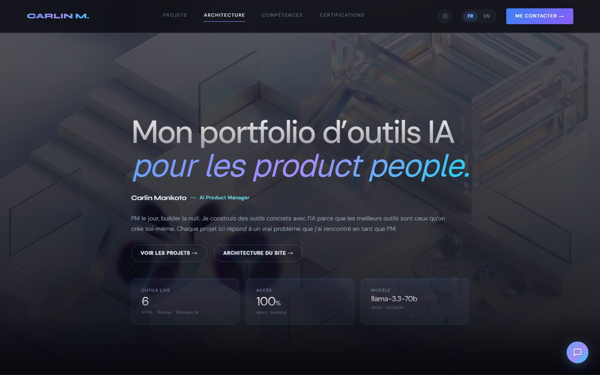
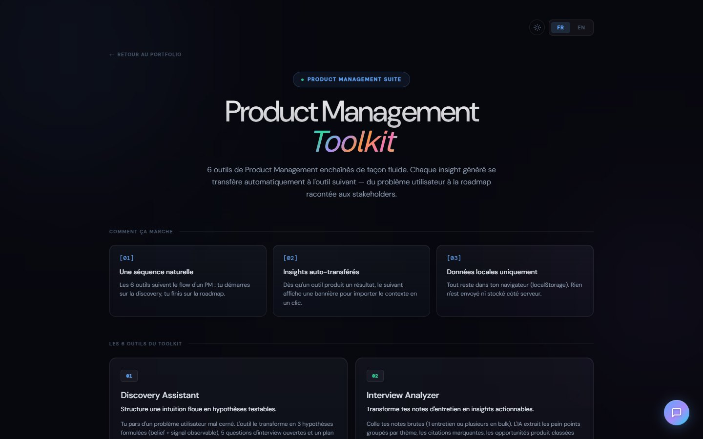
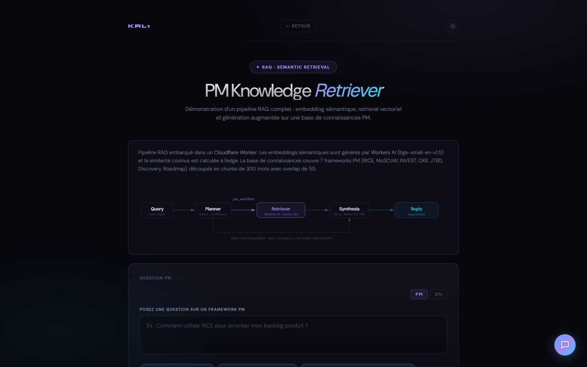

# KRL1 — AI Product Management Portfolio

Portfolio interactif de **Carlin Mankoto**, AI Product Manager, construit autour de trois expériences live :

- un **PM Toolkit** de 6 outils IA pour structurer discovery, priorisation, OKR, user stories, roadmap et analyse d'interviews ;
- un **RAG Explorer** pour interroger une base de connaissances product management depuis l'edge ;
- un mini-jeu web **Pixel Runner**.

**Live :** [cmankotech.github.io/cmankotech](https://cmankotech.github.io/cmankotech/)

## Aperçu







## Projets

| Outil | Description |
|---|---|
| **PM Toolkit** | Hub qui relie 6 outils PM dans un workflow complet : discovery → priorisation → OKR → user stories → roadmap → interview analysis |
| **Backlog Prioritizer** | Priorisation de backlog via RICE ou MoSCoW |
| **Discovery Assistant** | Transformation de problèmes en hypothèses, questions d'interview et plans de test |
| **Epic → User Stories** | Décomposition d'epics en user stories avec critères d'acceptation INVEST |
| **OKR Builder** | Génération d'Objectives & Key Results à partir d'un contexte stratégique |
| **Roadmap Storyteller** | Transformation de listes de features en narratifs de roadmap adaptés à l'audience |
| **User Interview Analyzer** | Analyse d'interviews utilisateur : personas, pain points, opportunités |
| **RAG Explorer** | Recherche sémantique dans une base de connaissances PM embarquée dans le Worker |
| **KRL1 Chat Widget** | Assistant flottant avec détection d'intent et routage contextuel vers les outils |
| **Pixel Runner** | Mini-jeu arcade en JavaScript (esquive d'obstacles, score local) |

Chaque outil IA est une SPA autonome en HTML/CSS/JS vanilla, bilingue FR/EN. Le mini-jeu est aussi une page statique autonome.

## Architecture

```
┌─────────────────────────────────┐
│   GitHub Pages (frontend)       │
│   Portfolio + PM Toolkit + RAG  │
│   krl1-widget.js (chat IA)     │
└──────────┬──────────────────────┘
           │ HTTPS
┌──────────▼──────────────────────┐
│   Cloudflare Worker (proxy/)    │
│   Sécurise les clés API        │
│   /orchestrate + /rag-query     │
└──────────┬──────────────────────┘
           │
┌──────────▼──────────────────────┐
│   Groq API (Llama 3.3 70B)     │
└─────────────────────────────────┘

┌─────────────────────────────────┐
│   Workers AI (edge, gratuit)    │
│   bge-small-en-v1.5 embeddings │
│   RAG sémantique natif Worker  │
└─────────────────────────────────┘
```

## Stack technique

- **Frontend :** HTML/CSS/JS vanilla, Google Fonts (Syne, DM Sans), thème sombre
- **Chat widget :** `krl1-widget.js` — assistant conversationnel flottant avec détection d'intent et routage contextuel
- **Proxy :** Cloudflare Workers (JavaScript), CORS, secrets serveur, KV pour compteur d'usage
- **RAG sémantique :** Workers AI (Cloudflare, bge-small-en-v1.5) — embeddings batch + cosine similarity, natif dans le Worker
- **LLM :** Groq API (llama-3.3-70b-versatile)
- **Déploiement :** GitHub Pages (front) + Cloudflare Workers (proxy)

## Structure du projet

```
├── index.html                  # Page portfolio principale
├── pm-toolkit.html             # Hub des 6 outils Product Management
├── rag-explorer.html           # Interface de recherche sémantique PM
├── backlog-prioritizer.html    # Outil priorisation backlog
├── discovery-assistant.html    # Outil discovery produit
├── epic-to-userstories.html    # Outil décomposition d'epics
├── okr-builder.html            # Outil OKR
├── roadmap-storyteller.html    # Outil narratif roadmap
├── user-interview-analyzer.html# Outil analyse d'interviews
├── pixel-runner.html           # Mini-jeu arcade
├── how-i-built-this.html       # Récit technique et décisions d'architecture
├── krl1-architecture.html      # Vue dédiée de l'architecture KRL1
├── krl1-widget.js              # Widget chat IA autonome
├── assets/                     # Fonds, vidéos et captures du README
├── orchestrator/               # Prototype Python LangGraph optionnel, non déployé
├── proxy/                      # Cloudflare Worker (JavaScript)
└── tests/                      # Tests du proxy
```

## Lancer en local

### Frontend

Servir les fichiers statiques depuis la racine :

```bash
npx serve .
```

### Proxy (Cloudflare Workers)

```bash
cd proxy
npx wrangler dev --config wrangler.toml
```

### RAG sémantique

Le pipeline RAG est natif dans le Worker (`proxy/src/index.js`). Aucune infra locale nécessaire : `POST /rag-query` fonctionne dès que le Worker est lancé.

### Tests

Depuis la racine :

```bash
node --test tests/proxy.test.mjs
```

Pour déployer en production :

```bash
npx wrangler deploy --config proxy/wrangler.toml
```

Le flag `--config` est obligatoire : sans lui, wrangler détecte le `wrangler.jsonc` racine (Cloudflare Pages) plutôt que le Worker.

Voir [`proxy/README.md`](proxy/README.md) pour plus de détails.
